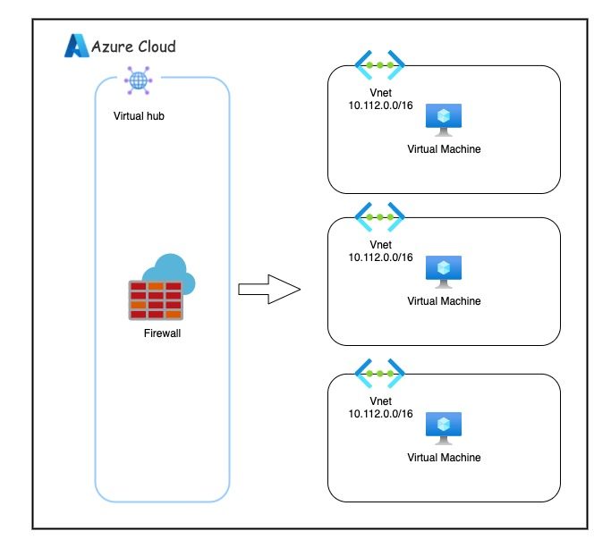

# Get Start with Azure Firewall
### Overview
We always want to limit the inbound and outbound traffic of our environment for protecting the service and the data. The firewall is the best choice for us the filter and blocks the traffic from the internet. Using the firewall we can customize the policy that we want to limit the traffic. In Azure, we can use the Azure firewall to achieve the goal.

The Azure Firewall is the intelligent network firewall security service. It can protect your Azure environment. It's a fully stateful, firewall as a service with built-in high availability and unrestricted cloud scalability.

By the end of this lab, you will be able to:
- Create the virtual wan
- Create the vitrual network and the virtual machine
- Create an Azure firewall in virtual wan
- Create the firewall policy for filtering the traffic



### Create Virtual Network

`Subnet Address Range` -> `IP Address Range` + `Size`

### Create Virtual WAN

`Specify number of Public IP addresses`


To find the firewall
1. goto Virtual Hub
2. security
3. scroll down to create a firewall

Firewall IP Configuration:
- public: `52.167.214.194`
- private: `10.0.64.4`


### Virtual Machine 1
```bash
ssh <your vm1 user name>@<your firewall public IP>
```

```bash
$ ssh hugolin@52.167.214.194

hugolin@52.167.214.194's password:
Welcome to Ubuntu 20.04.6 LTS (GNU/Linux 5.15.0-1058-azure x86_64)

 * Documentation:  https://help.ubuntu.com
 * Management:     https://landscape.canonical.com
 * Support:        https://ubuntu.com/pro

  System information as of Mon Mar 11 03:57:11 UTC 2024

  System load:  0.1               Processes:             107
  Usage of /:   6.5% of 28.89GB   Users logged in:       0
  Memory usage: 62%               IPv4 address for eth0: 10.112.0.4
  Swap usage:   0%


Expanded Security Maintenance for Applications is not enabled.

1 update can be applied immediately.
To see these additional updates run: apt list --upgradable

Enable ESM Apps to receive additional future security updates.
See https://ubuntu.com/esm or run: sudo pro status

New release '22.04.3 LTS' available.
Run 'do-release-upgrade' to upgrade to it.


Last login: Mon Mar 11 03:56:20 2024 from 10.0.64.6
To run a command as administrator (user "root"), use "sudo <command>".
See "man sudo_root" for details.
```

```bash
$ curl -I www.google.com
HTTP/1.1 200 OK
...
```

```bash
$  curl -I www.microsoft.com
HTTP/1.1 200 OK
...
```

### Virtual Machine 2

```bash
ssh -p 23 <your vm1 user name>@<your firewall public IP>
```

```bash
$ ssh -p 23 hugolin@52.167.214.194
The authenticity of host '[52.167.214.194]:23 ([52.167.214.194]:23)' can't be established.
ECDSA key fingerprint is SHA256:l5/pTzXnbaiIT4XAxOTK3Nn6yvLXvEI2SjmhKnXwNwo.
Are you sure you want to continue connecting (yes/no/[fingerprint])? yes
Warning: Permanently added '[52.167.214.194]:23' (ECDSA) to the list of known hosts.
hugolin@52.167.214.194's password:
Welcome to Ubuntu 20.04.6 LTS (GNU/Linux 5.15.0-1057-azure x86_64)

 * Documentation:  https://help.ubuntu.com
 * Management:     https://landscape.canonical.com
 * Support:        https://ubuntu.com/pro

 System information disabled due to load higher than 1.0

Expanded Security Maintenance for Applications is not enabled.

0 updates can be applied immediately.

Enable ESM Apps to receive additional future security updates.
See https://ubuntu.com/esm or run: sudo pro status


The list of available updates is more than a week old.
To check for new updates run: sudo apt update


The programs included with the Ubuntu system are free software;
the exact distribution terms for each program are described in the
individual files in /usr/share/doc/*/copyright.

Ubuntu comes with ABSOLUTELY NO WARRANTY, to the extent permitted by
applicable law.

To run a command as administrator (user "root"), use "sudo <command>".
See "man sudo_root" for details.
```

```bash
curl -I 142.250.80.36
HTTP/1.1 301 Moved Permanently
...
```

```bash
curl -I www.microsoft.com
HTTP/1.1 470 status code 470
...
```

###　Virtual Machine 3

Not open to the public access!

```bash
ssh -p 24 hugolin@52.167.214.194
```

```bash
ssh -p 24 hugolin@52.167.214.194
ssh: connect to host 52.167.214.194 port 24: Connection timed out
```


