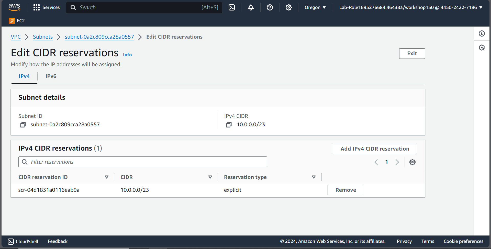

# Entry Level - VPC

### Overview
- Level: Basic
- Duration: 45 minutes
-----------------------------
VPC is one of the widely used AWS services, and your organization starts building a networked environment, requiring you to do a series of POCs.

目前遇到的困難﹔有成功建立 VPC, Route Table, Subnet, Internet Gateway 不過後續還是沒有成功

- https://docs.aws.amazon.com/vpc/latest/userguide/create-subnets.html
- https://www.ipvoid.com/ipv4-cidr-calculator/
- https://docs.aws.amazon.com/vpc/latest/userguide/configure-subnets.html#subnet-sizing
- https://docs.aws.amazon.com/vpc/latest/userguide/VPC_Route_Tables.html

Default VPC
- IPv4 CIDR: `10.0.0.0/16`
- Reserved IP: bigger than 260

#### Public Subnet

IPv4 CIDR: `10.0.0.0/23` (512 IP addresses, 2 reserved for AWS, 1 for the network address, 1 for the broadcast address, 508 for the instances)

1. create a subnet
2. create a route table
3. create internet gateway and attach to the VPC
4. edit subnet association from the route table
5. edit route table to add the route to the internet gateway `0.0.0.0/0` (public subnet)

#### Private Subnet

IPv4 CIDR: `10.0.254.0/23` (512 IP addresses, 2 reserved for AWS, 1 for the network address, 1 for the broadcast address, 508 for the instances)

1. create a subnet
2. create a route table
3. create NAT Gateway (choose the private subnet, allocate the Elastic IP)
4. edit subnet association from the route table
5. edit route table to add the route to the NAT gateway `0.0.0.0/0` (private subnet)

