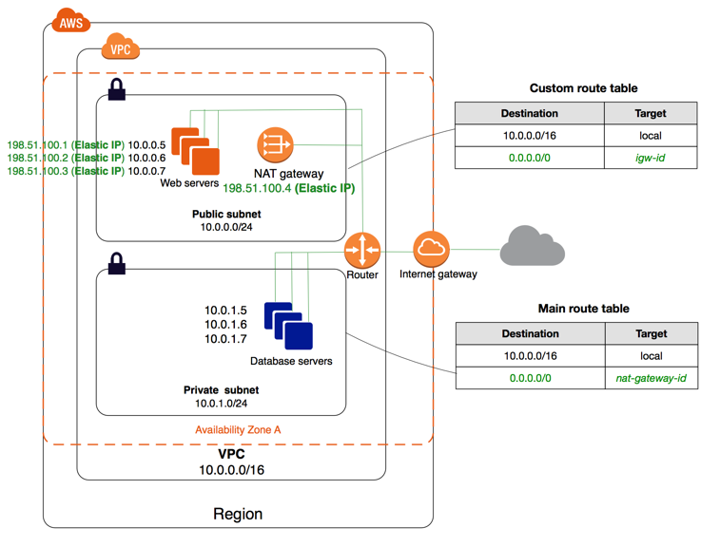
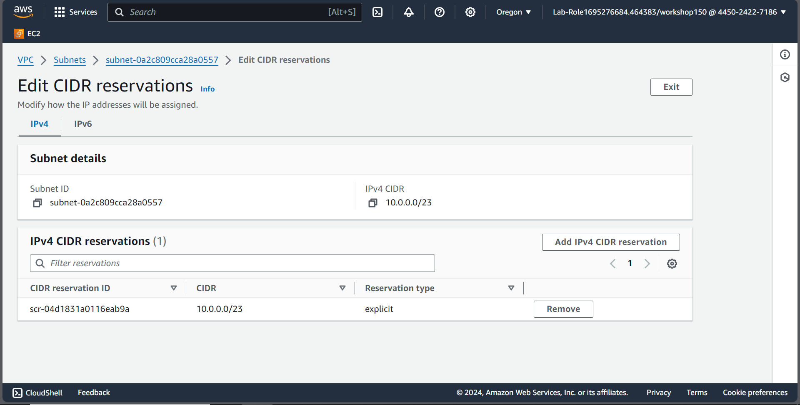

# ECV Internship Daily Journal

### 2023/03/11

In the morning, complete the 2024 MSP Intern training - Get Started with Azure Firewall. The training is about how to create the virtual network, virtual wan, and virtual machine. Then create the Azure Firewall in the virtual wan. Finally, create the firewall policy for filtering the traffic. We open two virtual machine to public IP, and then we can connect to the virtual machine through the public IP. Other than that, we can also use the Azure Firewall to filter the traffic.

---

### 2023/03/08

Complete all the AWS Entry Level Challenge tasks this morning, while 
also improve the concept of AWS VPC.

In the VPC, if we want ot connect to the external website, we will build 
the Internet Gateway and the NAT Gateway. The Internet Gateway is used to
connect to the Internet, and the NAT Gateway is used to enable the private
subnet to connect to the Internet.

Then the below is the VPC Architecture:

### 2024/03/06

上午主要了解  AWS 的網路連線，釐清了 VPC 以及 NAT 的差異

> [!NOTE]
> 1. Security Group is **stateful**, if you allow the inbound traffic, the response traffic is allowed automatically. No matter what the outbound rules are.
> 2. If we want to reach out to external network based on `NAT`. We need to allow the outbound traffic to the NAT Gateway.

### Entry - EC2

> [!NOTE]
> There is a question about creating `snapshot`, I have selected the `volume` into 9 GB, but after pending it will change into 8 GB.
>
> - **What I have tried:** delete snapshot; however, the snapshot is be used by the volume, so I cannot delete it.
> - **Solved:** I use the `modify volume` to change the size of the volume.  [^1]

### Entry - VPC

目前遇到的困難﹔有成功建立 VPC, Route Table, Subnet, Internet Gateway 不過後續還是沒有成功

- https://docs.aws.amazon.com/vpc/latest/userguide/create-subnets.html
- https://www.ipvoid.com/ipv4-cidr-calculator/
- https://docs.aws.amazon.com/vpc/latest/userguide/configure-subnets.html#subnet-sizing
- https://docs.aws.amazon.com/vpc/latest/userguide/VPC_Route_Tables.html

Default VPC
- IPv4 CIDR: `10.0.0.0/16`
- Reserved IP: bigger than 260

#### Public Subnet

IPv4 CIDR: `10.0.0.0/23` (512 IP addresses, 2 reserved for AWS, 1 for the network address, 1 for the broadcast address, 508 for the instances)

1. create a subnet
2. create a route table
3. create internet gateway and attach to the VPC
4. edit subnet association from the route table
5. edit route table to add the route to the internet gateway `0.0.0.0/0` (public subnet)

#### Private Subnet

IPv4 CIDR: `10.0.254.0/23` (512 IP addresses, 2 reserved for AWS, 1 for the network address, 1 for the broadcast address, 508 for the instances)

1. create a subnet
2. create a route table
3. create NAT Gateway (choose the private subnet, allocate the Elastic IP)
4. edit subnet association from the route table
5. edit route table to add the route to the NAT gateway `0.0.0.0/0` (private subnet)

### GitHub writing tips

#### Alerts
Alerts are a Markdown extension based on the blockquote syntax that you can use to emphasize critical information. On GitHub, they are displayed with distinctive colors and icons to indicate the significance of the content.

Use alerts only when they are crucial for user success and limit them to one or two per article to prevent overloading the reader. Additionally, you should avoid placing alerts consecutively. Alerts cannot be nested within other elements.

To add an alert, use a special blockquote line specifying the alert type, followed by the alert information in a standard blockquote. Five types of alerts are available:

> [!NOTE]
> Useful information that users should know, even when skimming content.

> [!TIP]
> Helpful advice for doing things better or more easily.

> [!IMPORTANT]
> Key information users need to know to achieve their goal.

> [!WARNING]
> Urgent info that needs immediate user attention to avoid problems.

> [!CAUTION]
> Advises about risks or negative outcomes of certain actions.
Here are the rendered alerts:

### 2024/03/05

早上參加 Fundamental Training，同時也了解了實習專案的內容以及時程，完成了 HR 發放的影片內容﹔EC2, Database，目標要把補考給考過!

### 2024/03/04

Onboard Day!

