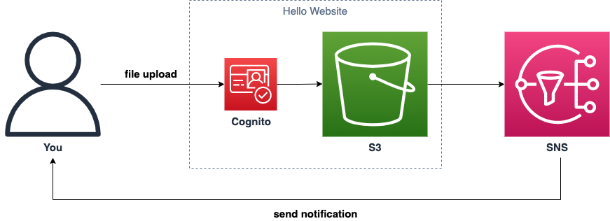

# Automatic Notification Workflow


### Overview
* Level: Basic
* Duration: 120 minutes

There will be many hackers in the real development environment. This challenge is simulating the real condition. So we will give you some broken environment. Please find the problem and try to fix it.




### Scenario
- s3 bucket: `challenge-static-website-xxx`
- SNS Topic: `challenge-sns-topic-xxx`
- IAM Role: `challenge-role-for-cognito`

## Allowing non-owners to publish messages to the SNS topic

> [!NOTE]
> If set `Event Notifaction` for the s3 bucket dircetly, it will occur the error because the `SNS topic ony allows owner to publish messages by default`. -> Need to modify the policy of the SNS topic to allow the s3 bucket to publish messages to the topic.

### To grant another AWS service permissions to publish to an Amazon SNS topic

Your Amazon SNS topic's resource-based policy must allow the other AWS service to publish messages to the topic. Review your topic's access policy to confirm that it has the required permissions, and add them if needed.

To add the required permissions, edit your Amazon SNS topic's access policy so that it includes the following permissions statement.
Important: Replace `<service>` with the AWS service.

```json
{
    "Sid": "Allow-AWS-Service-to-publish-to-the-topic",
    "Effect": "Allow",
    "Principal": {
        "Service": "<service>.amazonaws.com"
    },
    "Action": "sns:Publish",
    "Resource": "arn:aws:sns:your_region:123456789012:YourTopicName"
}
```

> [!TIP]
> These permissions allow anyone that has access to your SNS topic's Amazon Resource Name (ARN) to publish messages to the topic through the service endpoint. You can add global condition keys to restrict the publishing permissions to specific resources. The following example uses the arnLike condition operator and the aws:SourceArn global condition key. For more information, see Example cases for Amazon SNS access control. [^1]


### Steps

1. remove `StringEquals`
2. Change `Principal` from `"AWS": "*"` to `"Service": "s3.amazonaws.com"`
3. Include `AWS:SourceArn` within `ArnLike` in the `Condition` section.


#### Before:

```json
{
    "Version": "2008-10-17",
    "Id": "__default_policy_ID",
    "Statement": [
        {
            "Sid": "__default_statement_ID",
            "Effect": "Allow",
            "Principal": {
                "AWS": "*"
            },
            "Action": [
                "SNS:GetTopicAttributes",
                "SNS:SetTopicAttributes",
                "SNS:AddPermission",
                "SNS:RemovePermission",
                "SNS:DeleteTopic",
                "SNS:Subscribe",
                "SNS:ListSubscriptionsByTopic",
                "SNS:Publish"
            ],
            "Resource": "<YOUR_SNS_TOPIC_ARN>",
            "Condition": {
                "StringEquals": {
                    "AWS:SourceOwner": "<AWS_ACCOUNT_ID>"
                }
            }
        }
    ]
}
```

#### After:

```json
{
    "Version": "2008-10-17",
    "Id": "__default_policy_ID",
    "Statement": [
        {
            "Sid": "__default_statement_ID",
            "Effect": "Allow",
            "Principal": {
                "Service": "s3.amazonaws.com"
            },
            "Action": [
                "SNS:GetTopicAttributes",
                "SNS:SetTopicAttributes",
                "SNS:AddPermission",
                "SNS:RemovePermission",
                "SNS:DeleteTopic",
                "SNS:Subscribe",
                "SNS:ListSubscriptionsByTopic",
                "SNS:Publish",
            ],
            "Resource": "<YOUR_SNS_TOPIC_ARN>",
            "Condition": {
                "ArnLike": {
                    "AWS:SourceArn": "<YOUR_S3_BUCKET_ARN>"
                }
            }
        }
    ]
}            
```


## Subscribe to the SNS topic [^2]

Add own email address to the SNS subscription in the SNS topic.

## Unblock the CORS configuration for the S3 bucket [^3]

```json
[
    {
        "AllowedHeaders": [
            "*"
        ],
        "AllowedMethods": [
            "PUT",
            "POST",
            "DELETE"
        ],
        "AllowedOrigins": [
            "*"
        ],
        "ExposeHeaders": [
            "x-amz-server-side-encryption",
            "x-amz-request-id",
            "x-amz-id-2"
        ],
        "MaxAgeSeconds": 3000
    }
]
```

| Element | Description |
| --- | --- |
| AllowedMethod | In the CORS configuration, you can specify the following values: GET, PUT, POST, DELETE, HEAD |
| AllowedOrigin | You specify the origins that you want to allow cross-domain requests from, for example, `http://www.example.com`. The origin string can contain only one * wildcard character, such as `http://*.example.com`. You can optionally specify `*` as the origin to enable all the origins to send cross-origin requests. You can also specify `https` to enable only secure origins. |
| AllowedHeader | Specifies which headers are allowed in a preflight request through the `Access-Control-Request-Headers` header. Each header name in the `Access-Control-Request-Headers` header must match a corresponding entry in the rule. Amazon S3 will send only the allowed headers in a response that were requested. Each AllowedHeader string in the rule can contain at most one `*` wildcard character. For example, `<AllowedHeader>x-amz-*</AllowedHeader>` will enable all Amazon-specific headers. |
| ExposeHeader | Each ExposeHeader element identifies a header in the response that you want customers to be able to access from their applications (for example, from a JavaScript `XMLHttpRequest` object). |
| MaxAgeSeconds | Specifies the time in seconds that your browser can cache the response for a preflight request as identified by the resource, the HTTP method, and the origin. |


[^1]: [Why can't I publish or subscribe to an Amazon SNS topic?](https://repost.aws/knowledge-center/sns-publish-subscribe-troubleshooting)
[^2]: [Creating and Subscribing to SNS Topics and Adding SNS event for S3 bucket](https://medium.com/@ernestosafo11/creating-and-subscribing-to-sns-topics-and-adding-sns-event-for-s3-bucket-df2e9cfb9d5d)
[^3]: [CORS configuration #Example 2](https://docs.aws.amazon.com/AmazonS3/latest/userguide/ManageCorsUsing.html#cors-allowed-origin)
