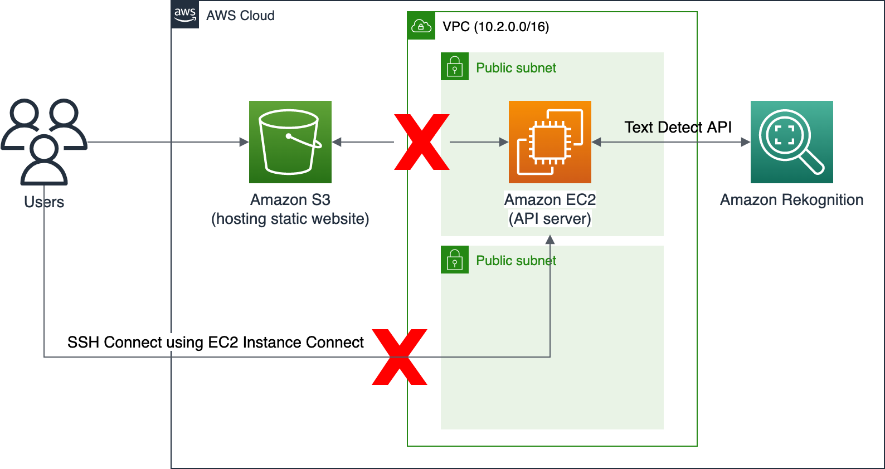
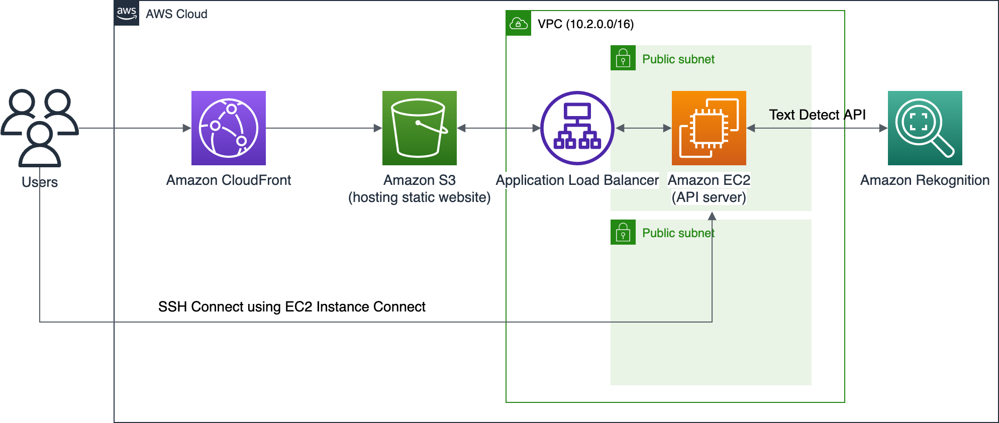

# Fixing the Text Detection Api
### Overview
- Level: Advanced
- Duration: 180 minutes

Now, there is a request saying that the Text Detect API using the AWS SDK of Amazon Rekognition is not functional. Could you help to solve the problem?




## S3 Bucket Policy

### Original

```json
{
	"Version": "2012-10-17",
	"Statement": [
		{
			"Effect": "Allow",
			"Principal": {
				"AWS": "iam-user-arn"
			},
			"Action": [
				"s3:DeleteObject*",
				"s3:GetBucket*",
				"s3:List*"
			],
			"Resource": [
				"challenge-s3-arn",
				"challenge-s3-arn/*"
			]
		}
	]
}
```


### Worked

```json
{
    "Version": "2012-10-17",
    "Statement": [
        {
            "Sid": "PublicReadGetObject",
            "Effect": "Allow",
            "Principal": "*",
            "Action": [
                "s3:GetObject",
                "s3:PutObject"
            ],
            "Resource": [
                "arn:aws:s3:::challenge-static-website-c85813fdac070e2f/*"
            ]
        }
    ]
}
```

> [!NOTE]
> Why is the below s3 policy cannot save?

```json
{
	"Version": "2012-10-17",
	"Statement": [
		{
			"Effect": "Allow",
			"Principal": "*",
			"Action": [
				"s3:DeleteObject*",
				"s3:GetBucket*",
				"s3:List*"
			],
			"Resource": [
				"arn:aws:s3:::challenge-static-website-c85813fdac070e2f",
				"arn:aws:s3:::challenge-static-website-c85813fdac070e2f/*"
			]
		}
	]
}
```

```json
{
	"Version": "2012-10-17",
	"Statement": [
		{
			"Effect": "Allow",
			"Principal": {
				"AWS": "arn:aws:iam::571760228216:role/lab-prewarming-766-CustomS3AutoDeleteObjectsCustomR-oL88oGiCkfrI"
			},
			"Action": [
				"s3:DeleteObject*",
				"s3:GetBucket*",
				"s3:List*"
			],
			"Resource": [
				"arn:aws:s3:::challenge-static-website-c85813fdac070e2f",
				"arn:aws:s3:::challenge-static-website-c85813fdac070e2f/*"
			]
		}
	]
}
```

## [PROBLEM] Cannot start the API Server

```bash
sudo amazon-linux-extras enable php7.4

  2  httpd_modules            available    [ =1.0  =stable ]
  3  memcached1.5             available    \
        [ =1.5.1  =1.5.16  =1.5.17 ]
  9  R3.4                     available    [ =3.4.3  =stable ]
 10  rust1                    available    \
        [ =1.22.1  =1.26.0  =1.26.1  =1.27.2  =1.31.0  =1.38.0
          =stable ]
 18  libreoffice              available    \
        [ =5.0.6.2_15  =5.3.6.1  =stable ]
 19  gimp                     available    [ =2.8.22 ]
 20 †docker=latest            enabled      \
        [ =17.12.1  =18.03.1  =18.06.1  =18.09.9  =stable ]
 21  mate-desktop1.x          available    \
        [ =1.19.0  =1.20.0  =stable ]
 22  GraphicsMagick1.3        available    \
        [ =1.3.29  =1.3.32  =1.3.34  =stable ]
 23 †tomcat8.5                available    \
        [ =8.5.31  =8.5.32  =8.5.38  =8.5.40  =8.5.42  =8.5.50
          =stable ]
 24  epel                     available    [ =7.11  =stable ]
 25  testing                  available    [ =1.0  =stable ]
 26  ecs                      available    [ =stable ]
 27 †corretto8                available    \
        [ =1.8.0_192  =1.8.0_202  =1.8.0_212  =1.8.0_222  =1.8.0_232
          =1.8.0_242  =stable ]
 32  lustre2.10               available    \
        [ =2.10.5  =2.10.8  =stable ]
 33 †java-openjdk11           available    [ =11  =stable ]
 34  lynis                    available    [ =stable ]
 36  BCC                      available    [ =0.x  =stable ]
 37  mono                     available    [ =5.x  =stable ]
 38  nginx1                   available    [ =stable ]
 40  mock                     available    [ =stable ]
 42 *php7.4=latest            enabled      [ =stable ]
 43  livepatch                available    [ =stable ]
 44 †python3.8                available    [ =stable ]
 45  haproxy2                 available    [ =stable ]
 46  collectd                 available    [ =stable ]
 47  aws-nitro-enclaves-cli   available    [ =stable ]
 48  R4                       available    [ =stable ]
 49  kernel-5.4               available    [ =stable ]
 50  selinux-ng               available    [ =stable ]
 52  tomcat9                  available    [ =stable ]
 53  unbound1.13              available    [ =stable ]
 54 †mariadb10.5              available    [ =stable ]
 55  kernel-5.10              available    [ =stable ]
 56  redis6                   available    [ =stable ]
 57 †ruby3.0                  available    [ =stable ]
 58 †postgresql12             available    [ =stable ]
 59 †postgresql13             available    [ =stable ]
 60  mock2                    available    [ =stable ]
 61  dnsmasq2.85              available    [ =stable ]
 62  kernel-5.15              available    [ =stable ]
 63 †postgresql14             available    [ =stable ]
 64  firefox                  available    [ =stable ]
 65  lustre                   available    [ =stable ]
  _ †php8.1                   available    [ =stable ]
 67  awscli1                  available    [ =stable ]
  _ †php8.2                   available    [ =stable ]
 69  dnsmasq                  available    [ =stable ]
 70  unbound1.17              available    [ =stable ]
 72  collectd-python3         available    [ =stable ]
* Extra topic has reached end of support.
† Note on end-of-support. Use 'info' subcommand.

Now you can install:
 # yum clean metadata
 # yum install php-cli php-pdo php-fpm php-json php-mysqlnd
```


```bash
sudo service httpd start

Redirecting to /bin/systemctl start httpd.service
```

```bash
status httpd.service
● httpd.service - The Apache HTTP Server
   Loaded: loaded (/usr/lib/systemd/system/httpd.service; disabled; vendor preset: disabled)
   Active: active (running) since Wed 2024-03-13 09:29:44 UTC; 1min 48s ago
     Docs: man:httpd.service(8)
 Main PID: 31885 (httpd)
   Status: "Total requests: 0; Idle/Busy workers 100/0;Requests/sec: 0; Bytes served/sec:   0 B/sec"
   CGroup: /system.slice/httpd.service
           ├─31885 /usr/sbin/httpd -DFOREGROUND
           ├─31886 /usr/sbin/httpd -DFOREGROUND
           ├─31888 /usr/sbin/httpd -DFOREGROUND
           ├─31893 /usr/sbin/httpd -DFOREGROUND
           ├─31899 /usr/sbin/httpd -DFOREGROUND
           └─31905 /usr/sbin/httpd -DFOREGROUND

Mar 13 09:29:44 ip-10-2-0-237.us-west-2.compute.internal systemd[1]: Starting The Apache HTTP Server...
Mar 13 09:29:44 ip-10-2-0-237.us-west-2.compute.internal systemd[1]: Started The Apache HTTP Server.
```

https://talk.plesk.com/threads/fpm-application-server-by-apache-stopped-working.354355/
```bash
sudo service httpd restart
```

```bash
cat /usr/lib/systemd/system/httpd.service.d/php-fpm.conf 
[Unit]
Wants=php-fpm.service
```

### Research about `0.0.0.0/32`

| Status | Type | Protocol | Port Range | Source | Description |
| --- | --- | --- | --- | --- | --- |
| Not Work | HTTP | TCP | 80 | Custom `0.0.0.0/32` | from 0.0.0.0/32:80 |
| Work | HTTP | TCP | 80 | Custom `0.0.0.0/0` | |

We need to allow the `80` port to be accessed from `0.0.0.0/0` instead of `0.0.0.0/32`

> [!TIP]
> - `0.0.0.0/0`: means all ipv4 addresses.
> - `0.0.0.0/32` means only the single IPv4 address of `0.0.0.0` - which I don’t think will mean anything in a security group as if a device has that IP address it can’t communicate on a IP network.

### Check `/var/www/html`

```bash
$ cd /var/www/html

$ ls
composer.json  composer.lock  index.php  __MACOSX  vendor

$ cat index.php
<?php
header("Access-Control-Allow-Headers: *");
header("Access-Control-Allow-Origin: *");
if($_SERVER['REQUEST_METHOD'] == "OPTIONS"){
  echo "CORS OK!";
  die();
}
// If you want to debug, uncomment next line.
// ini_set("display_errors", 1);
// Require composer autoload
use Aws\Rekognition\RekognitionClient;
require_once __DIR__ . '/vendor/autoload.php';

// Define picture from POST
$pict = file_get_contents("php://input");

// Setup Rekognition client
$options = [ 'region' => 'us-east-1', 'version' => 'latest' ];
$client = new RekognitionClient($options);

// Send API request
$result = $client->detectText([ "Image" => [ "Bytes" => $pict ] ]);

// [TODO] Parse response to JSON
// API Reference: https://docs.aws.amazon.com/aws-sdk-php/v3/api/api-rekognition-2016-06-27.html#detecttext
$output = [ "text" => "", "src_ip" => $_SERVER["REMOTE_ADDR"]];

// JSON Output
header("Content-Type: Application/json");
print_r(json_encode($output));
```

### Install PHP and Apache

```bash
$ sudo yum install php -y
Loaded plugins: extras_suggestions, langpacks, priorities, update-motd
amzn2-core                                                                                                          | 3.6 kB  00:00:00     
Package php-7.4.33-1.amzn2.x86_64 already installed and latest version
Nothing to do

$ sudo yum install httpd -y
Loaded plugins: extras_suggestions, langpacks, priorities, update-motd
Package httpd-2.4.58-1.amzn2.x86_64 already installed and latest version
Nothing to do
```


### Start the Apache Server

```bash
$ sudo service httpd start
Redirecting to /bin/systemctl start httpd.service
```

## Edit the Permission to the Rekognition API

### Edit `index.html` to use the correct endpoint

```html
const api_url = "<CHANGE_TO_YOUR_ENDPOINT>";
```


> [!NOTE]
> edit `/var/www/html` in the ec2 instance
> 
> `sudo vi /var/www/html/index.php` to edit the file

## Improve the User Experience

### [QUESTION] Add Application Balancer between the s3 bucket and ec2 instance

Load Balancer, CloudFront


https://docs.aws.amazon.com/elasticloadbalancing/latest/application/create-application-load-balancer.html




- https://docs.aws.amazon.com/AmazonS3/latest/userguide/HostingWebsiteOnS3Setup.html
- https://docs.aws.amazon.com/AmazonS3/latest/userguide/CustomErrorDocSupport.html
- https://docs.aws.amazon.com/AmazonS3/latest/userguide/IndexDocumentSupport.html


https://forums.fedoraforum.org/showthread.php?291585-Can-t-start-httpd-service!

https://serverfault.com/questions/1088121/systemctl-restart-httpd-failed-to-start-the-apache-http-server-httpd-pid-already

https://www.linuxquestions.org/questions/linux-software-2/php-file-hosted-locally-in-var-www-html-shows-blank-in-browser-913439/

https://unix.stackexchange.com/questions/468058/systemctl-status-shows-vendor-preset-disabled

https://serverfault.com/questions/625261/root-directory-var-www-html-apach2-on-ubuntu-14-04


[^1]: [Is there a difference between 0.0.0.0/0 and 0.0.0.0/32 ?](https://www.reddit.com/r/aws/comments/uh0hzm/is_there_a_difference_between_00000_and_000032/?rdt=60970)


