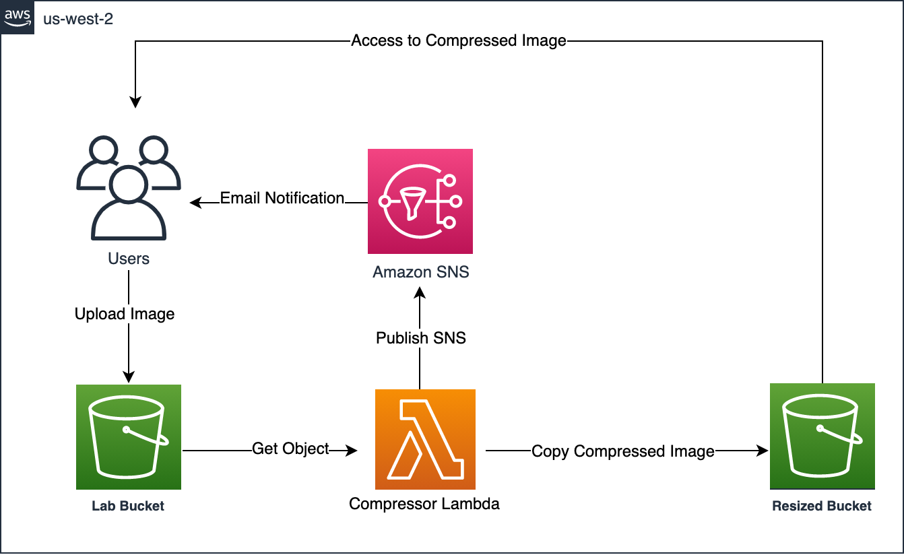

# Serverless Automatic Thumbnail Process on AWS
### Overview
- Level: Basic
- Duration: 120 minutes

Your organization has set up a social networking site and wants to thumbnail images uploaded by users for different devices. However, the superior does not want to maintain the infrastructure of this system, so you want to implement it through a serverless architecture.

https://docs.aws.amazon.com/zh_tw/AmazonS3/latest/userguide/tutorial-s3-object-lambda-uppercase.html