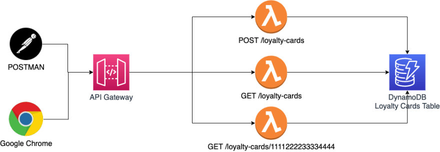

# Create a simple app in Lambda and DynamoDB with Serverless Framework

### Overview

- Level: Advanced
- Duration: 180 minutes

------------------------------
You are the dev lead (aka 'the only dev') of a chain of restaurants. To increase sales, your boss wants you to create a simple loyalty application. He has heard of the Serverless Framework and how it allows your team to use serverless technologies like Lambda to deploy your application. Your boss is particularly sensitive to cost. Since Lambda only charges you when the code is run (when someone uses your app), your boss is thrilled to introduce the technology.

Contributor: Raphael Jambalos

## Specifications
Create 3 Lambda functions for each endpoint:

POST /loyalty-cards: create a loyalty card
GET /loyalty-cards/10: display the loyalty card you just created using the id
GET /loyalty-cards: display all loyalty cards




## API

- `createLoyaltyCard`

request body sample:
```json
{
  "name": "Raphael Jambalos",
  "email": "raphael.jambalos@ecloudvalley.com"
}
```

response body sample:
```json
{
  "card_number": "ecv6689",
  "name": "Raphael Jambalos",
  "email": "raphael.jambalos@ecloudvalley.com"
}
```

- `getOneLoyaltyCard`

response body sample:
```json
{
  "result": {
    "items": [
      {"card_number": "1", "name": "1", "email": "1"}
    ],
    "last_evaluated_key": "None"
  }
}
```
- `createLoyaltyCard`

response body sample:
```json
{
  "result": {
    "items": [
      {"card_number": "1", "name": "1", "email": "1"},
      {"card_number": "2", "name": "2", "email": "2"},
      {"card_number": "3", "name": "3", "email": "3"}
    ],
    "last_evaluated_key": "3"
  }
}
```


https://www.serverless.com/examples

https://dev.to/raphael_jambalos/challenge-1-create-a-simple-app-in-lambda-dynamodb-serverless-framework-of6