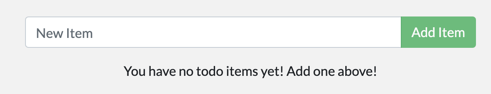

# Docker 101 Challenge

Follow the steps listed below to build a TODO Manager Node.js web app in Docker.
Estimated Time: 2-4 hours.

## Step 1. Build and Run as it is

1. Pull this repository and Investigate the files in it.
2. Build the Docker Image from this repo and Run it locally.

    > hint:
    >
    > Remember to open the correct port when running the container (Default port for node.js is 3000)

3. You should be able to see the following app in your web browser.
   

## Step 2. Update the app

1. Notice that the app currently show "No items yet! Add one above!" when no item is added. Update the app to show "You have no todo items yet! Add one above!" instead.
   

    > hint:
    >
    > The source code of the app is under /src directory. Search the repository to find where to update the code.

2. Rebuild and Start a new container with the updated app

## Step 3. Persist our Data with Container Volume

1. Notice that the data in your TODO app is deleted after you restart the container (assuming you haven't already somehow persist the data)
2. Keep your data in the TODO app using Container Volume

    > hint:
    >
    > The todo app stores its data in a [SQLite Database](https://www.sqlite.org/index.html) at /etc/todos/todo.db
    > SQLite is a relational database in which all of the data is stored in a single file

## Step 4. Instant Code Change with Bind Mount during Development

1. Notice that perviously we have to rebuild/restart the container to reflect our code change in app. This can be too tedious during development. Therefore, developers usually run their app in development mode to reflect their code change faster.
2. Run the TODO app in development mode

    > hint:
    >
    > 1. The command to install dependencies and run this TODO app in development mode is "yarn install && yarn run dev". You will need to run this command with sh in the container.
    > 2. You don't need to use your previous built image for this task. Might be easier to directly run the container with node:12-alpine image with the correct command.

3. It can take slightly longer to start the application in development mode. You can check the logs of the container to verify that the web app is running. You should see something like the following in the logs:

    ```=sh
    $ nodemon src/index.js
    [nodemon] 1.19.2
    [nodemon] to restart at any time, enter `rs`
    [nodemon] watching dir(s): *.*
    [nodemon] starting `node src/index.js`
    Using sqlite database at /etc/todos/todo.db
    Listening on port 3000
    ```

## Step 5. Separate the Database

1. Notice that up to this point, we have been working with single container app. We are now separating our database to another container
2. Create a docker network for your application stack
3. Launch MySQL in the created network

    > hint:
    >
    > 1. You can use the [official mysql image](https://hub.docker.com/_/mysql) for this (We have tested with mysql:5.7)
    > 2. You might want to persist the mysql data for your application
    > 3. You can use [docker exec](https://docs.docker.com/engine/reference/commandline/exec/) to execute command in any container

4. Connect your TODO app to this MySQL

    > hint:
    >
    > The todo app supports setting the following Environment Variables to set up MySql Connection:
    >
    > - MYSQL_HOST - the hostname for the running MySQL server
    > - MYSQL_USER - the username to use for the connection
    > - MYSQL_PASSWORD - the password to use for the connection
    > - MYSQL_DB - the database to use once connected
    >
    > You should run the TODO app in container with these environment variables set according to your MySQL container

## Bonus Challenge. Launch the app in ECS

Knowing what you have learning now, maps the knowledge and terminology in docker to ECS and create a working [ECS task definition](https://docs.aws.amazon.com/AmazonECS/latest/developerguide/task_definitions.html) to launch this TODO app in ECS.
