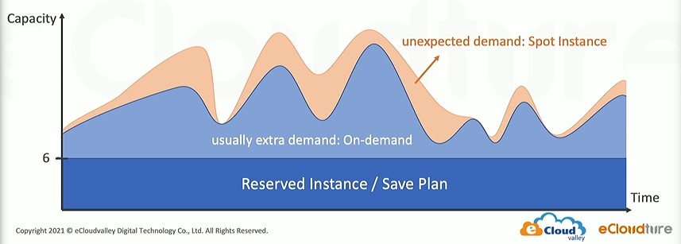

# Chapter 3 - Elastic Compute Cloud (EC2)

Amazon Machine Image (AMI)
- Operating System
- Launch Permission
- Root Volume Mapping

Instance Type
`i3.xlarge` (instance family, instance generation, instance size)

## User Data

In the initial process, with the `User Data`, we can install some needed content in our services.

```bash
#!/bin/bash

yum install -y httpd amazon-linux-extras
amazon-linux-extras install php7.2
```

### Custom AMI

We have run some scripts about our user data, then we need the mechanism to wrap our product while also the simplify workflow. 

With the packed AMI, we can create the same developing environment.

### EC2 Metadata
endpoint: `http://169.254.169.254/lastest/meta-data`

Through metadata tracking the flow of the EC2.

## Management EC2

### Placement Group
- Cluster: in a single Availability Zone, `10 Gbps` flow limit
- Spread: placed on distinct racks, maximum of 7 running instances per AZ
- Partition: own set of racks, different machines
- tag: `key: value`

## EC2 Lifecycle

- stop: if we stopped the EC2, once we restart the EC2, the public IP will be changed
- Hibernate: put `RAM` into the EBS Volume to keep the data in the `RAM`
- Reboot: restart OS, `RAM` is erased

### Instance Store

- Non-persistent storage
- Data not replicated
- No snapshot support

## Elastic Block Storage (EBS)

only attaches to one instance

- General Purpose SSD (gp3)
- Provisioned IOPS (io2)
- Throughput Provisioned (st1)
- Cold HDD (sc1)

### EBS Optimized 

Elastic Network Interface: EC2 <-> EBS and public ->　Too much workflow pressure  
Solved: Add more Elastic Network Interface

### EBS Snapshot

Cross-Region and AZ

### EBS Encryption
If we want to use Encryption, we have to enable at first, or we have to utilize snapshot to create another EBS then we can add the service of encryption.

## Shared File System

Shared Across: AZ, Region, VPC, Account

Mount Target in every AZ

## EC2 Pricing Model
- on-demand: short-term, unpredictable workloads, no up-front payment
- spot instance: remaining computing resource of AWS, interupible workloads because of this is the rest of the resource
- reserved instance: steady-state usage, 1-3 years, predictable recurring schedule
- Savings Plan: commit to **usage** of individual instance family in a region, 1-3 years
- Dedicated Instance: no other customer will share the hardware with you (compliance, security)
- Dedicated Host: physical server, control over the instance placement


Basically, 6 EC2 are needed every day, but there are usually some extra requirements. During peak season, there will be unexpected demand.




